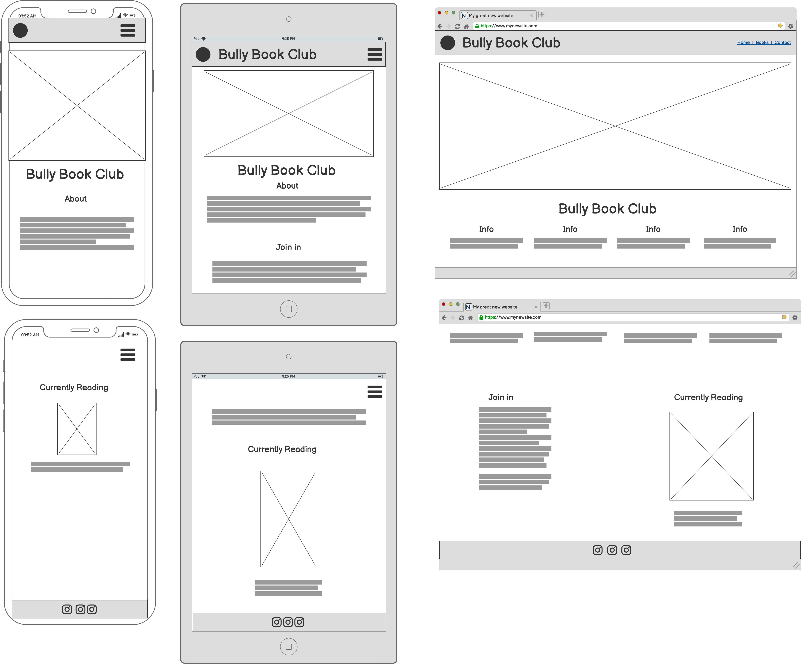
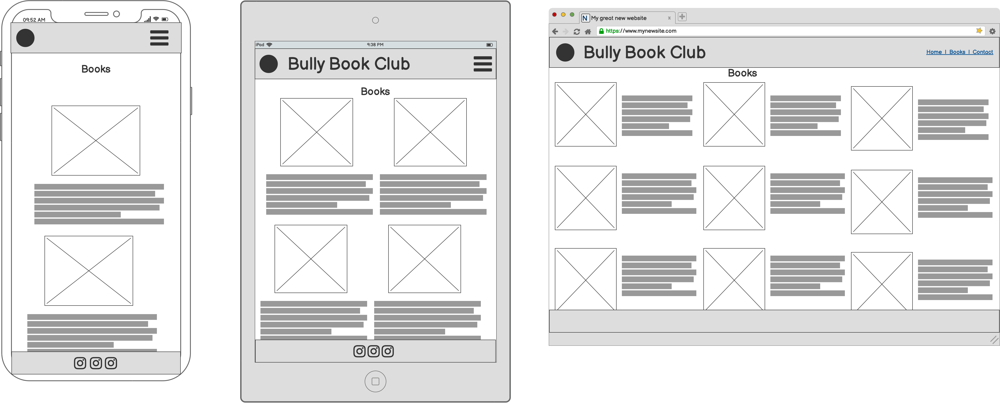
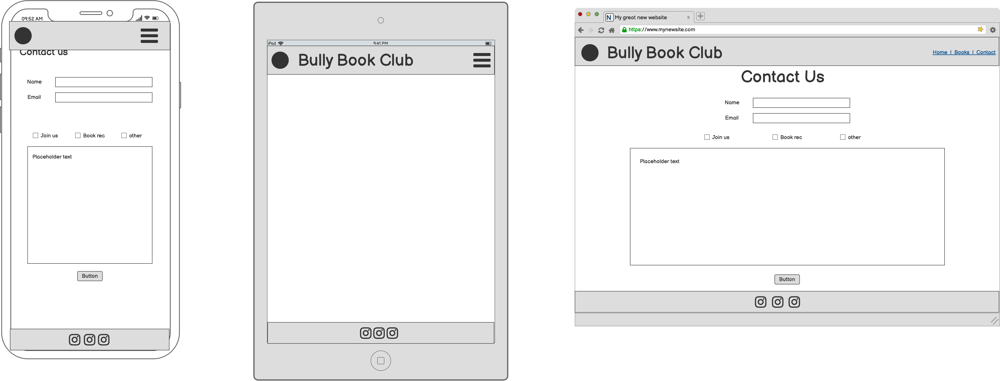

# Bully Book Club Website

The Bully Book Club website is designed to be responsive website allowing visitors to view on a range of devices. It allows visitors to find out about the book club.

[View Bully Book Club on Github Pages](https://kera-cudmore.github.io/milestone-project-one-ci/)

Screenshot of the website to go here.

## CONTENTS

* [User Experience (UX)](#User-Experience-(UX))
  * [Initial Discussion](#Initial-Discussion)
  * [User Stories](#User-Stories)

* [Design](#Design)
  * [Colour Scheme](#Colour-Scheme)
  * [Typography](#Typography)
  * [Imagery](#Imagery)
  * [Wireframes](#Wireframes)
  * [Features](#Features)

* [Technologies Used](#Technologies-Used)
  * [Languages Used](#Languages-Used)
  * [Frameworks, Libraries & Programs Used](#Frameworks,-Libraries-&-Programs-Used)

* [Deployment](#Deployment)
  * [Initial Deployment](#Initial-Deployment)
  * [How to Fork](#How-to-Fork)
  * [How to Clone](#How-to-Clone)

* [Testing](#Testing)
  * [W3C Validator](#W3C-Validator)
  * [Testing User Stories](#Testing-User-Stories)
  * [Full Testing](#Full-Testing)
  * [Further Testing](#Further-Testing)
  * [Solved Bugs](#Solved-Bugs)
  * [Known Bugs](#Known-Bugs)
  * [Lighthouse](#Lighthouse)
    * [Performance](#Performance)
    * [Accessibility](#Accessibility)
    * [Best Practices](#Best-Practices)
    * [SEO](#SEO)
  
* [Credits](#Credits)
  * [Code Used](#Code-Used)
  * [Content](#Content)
  * [Media](#Media)
  * [Acknowledgments](#Acknowledgments)

- - -

## User Experience (UX)

### Initial Discussion

Bully Book Club is an online book club that reviews a book once a month on Instagram. Members post a photo of the book with their bulldog with a review and use hashtags to drive up the visibility of the chosen book, author and publisher on that day.

Due to a recent growth in membership and personal commitments, the owner of bully book club is spending a large amount of time answering questions from users asking what the book club is reading and how to participate.

#### Key information for the site

* What is the current months book.
* What are the next books.
* How to become a member and take part.
* A way for people to contact the book club with questions and recommendations.
* Updates on what is coming to the book club in 2022.

### User Stories

#### Client Goals

* To be able to view the site on a range of device sizes.
* To make it easy for potential members to find out what the book club is and how to take part.
* To make it clear for members to see what we are currently reading and what is coming up next.
* To allow people to be able to contact the Book Club to ask further questions or with book recommendations etc.

#### First Time Visitor Goals

* I want to find out what is Bully Book Club and how I can take part.
* I want to be able to navigate the site easily to find information.
* I want to be able to find their Instagram profile.

#### Returning Visitor Goals

* I want to find up to date information on what the book club is reading.
* I want to be able to easily contact the book club with questions I might have.

#### Frequent Visitor Goals

* I want to be able to recommend a book for the book club to read.

- - -

## Design

### Colour Scheme

The website uses a palette of pastel colours that are often used in the Bully Book Club logo images. The colour palette was created using the [Coolors](https://coolors.co/) website.

### Typography

Google Fonts was used for the following fonts:

* Merriweather is used for headings on the site. It is a serif font.

* Raleway is used for the body text on the site. It is a sans-serif font.  

### Imagery

### Wireframes

Wireframes were created for mobile, tablet and desktop.

Home Page

Books Page

Contact Us Page

### Features

- - -

## Technologies Used

### Languages Used

HTML and CSS were used to create this website.

### Frameworks, Libraries & Programs Used

Balsamiq - Used to create wireframes.

Git - For version control.

Github - To save and store the files for the website.

Bootstrap Version 4.6 - The framework for the website. Additional CSS styling was also implemented in style.css

Google Fonts - To import the fonts used on the website.

Font Awesome - For the iconograpgy on the website.

Google Dev Tools - To find the correct code for the selected feature.

[Tiny PNG](https://tinypng.com/) To compress images.

[Birme](https://www.birme.net/) To resize images.

[Favicon.io](https://favicon.io/) To create favicon

- - -

## Deployment

### Initial Deployment

Github Pages was used to deploy the live website. The instructions to achieve this are below:

1. Log in (or sign up) to Github.
2. Find the repository for this project, milestone-project-one-ci.
3. Click on the Settings link.
4. Click on the Pages link in the left hand side navigation bar.
5. In the Source section, choose main from the drop down select branch menu. Select Root from the drop down select folder menu.
6. Click Save. Your live Github Pages site is now deployed at the URL shown.

### How to Fork

1. Log in (or sign up) to Github.
2. Go to the repository for this project, milestone-project-one-ci.
3. Click the Fork button in the top right corner.

### How to Clone

List how to clone the project on github here step by step.

- - -

## Testing

A few issues were pointed out during my mid project meeting with my mentor:

* The Join Us section on the home page was not in alignment with the rest of the page. ~ Padding has now been added to bring it in alignment with the rest of the pages padding.
* There was an issue on smaller devices where the book columns were not displaying properly. ~ more information under issue 2 in solved bugs.
* The introduction paragraph on the books page was not aligned in style with the rest of the page. ~ The text has now been centered.
* The form could be submitted with only a name filled in. ~ A required attribute has been added to the email input.

### W3C Validator

### Testing User Stories

### Full Testing

### Further Testing

### Solved Bugs

1. The navbar would lose its alignment when on smaller devices, with the navbar brand pushing the burger icon down and over to the left underneath the site logo. This did not make for a good user experience, as the sites navigation for other sizes is on the right hand side of the navbar. While searching through the bootstrap documentation for navigation bars it directed me to display properties and hiding elements. Once I added the correct class I was then able to hide the navbar brand on devices smaller than a tablet, allowing the alignment of the navbar items to stay in place where I wanted them.

2. The cards on the books page were very long when on smaller devices, causing the user to scroll for a while before seeing the next book. By using a media query to hide the card body I am able to condense the card for a better viewing experience on smaller devices.

3. Halfway down the books page on small devices the columns would jump from displaying one column to displating two colums. After trying several ways to change this with no effect, I posed the problem to the slack community. Simen Daehlin suggested that I specify on the column class what sizes I would use for the screen sizes. By adding these column size classes it has resolved the problem. 

4. The textarea required attribute wasn't activating when the form was submitted. After searching for an answer, I asked on slack and Dave Horrocks spotted that as I had a message in the textarea it was reading that as a message had been entered in the textarea. By adding the message into a placeholder the issue has been rectified.

5. When viewing the books page which is very long, you would have to scroll all the way back up to the top to reach any navigation links. I thought a scroll to top button that floats on the bottom right would fix this problem, however I do not have any javascript knowledge currently to be able to achieve this. My only alternative, which was also suggested by Dave Horrocks on Slack, would be to change the top navbar to be fixed to the top. By adding the bootstrap class fixed-top I was able to achieve this.

### Known Bugs

### Lighthouse

#### Performance

#### Accessibility

#### Best Practices

#### SEO

- - -

## Credits

### Code Used

* [Abi Harrison's Meta Tags webinar and repository](https://github.com/Abibubble/meta-tags-example)
* [Tutorial to change bullet images to emojis](https://daily-dev-tips.com/posts/css-emoji-list-style/)

### Content

### Media

#### Book Cover Images

* Each book cover was taken from the publishers website.

2022 Books

[Taste](https://www.simonandschuster.com/books/Taste/Stanley-Tucci/9781982168018)

2021 Books

[A Pinch of Magic](https://www.simonandschuster.co.uk/books/A-Pinch-of-Magic/Michelle-Harrison/A-Pinch-of-Magic-Adventure/9781471124297) ~
[The Devil Wears Prada](https://harpercollins.co.uk/products/the-devil-wears-prada-loved-the-movie-read-the-book-lauren-weisberger?variant=32555806359630) ~
[A Discovery of Witches](https://www.penguinrandomhouse.com/books/307548/a-discovery-of-witches-movie-tie-in-by-deborah-harkness/) ~
[The Southern Book Clubs Guide to Slaying Vampires](https://www.penguinrandomhouse.com/books/608677/the-southern-book-clubs-guide-to-slaying-vampires-by-grady-hendrix/) ~
[The Last Thing He Told Me](https://www.simonandschuster.com/books/The-Last-Thing-He-Told-Me/Laura-Dave/9781501171345) ~
[A Good Girls Guide to Murder](www.penguinrandomhouse.com/books/607351/a-good-girls-guide-to-murder-by-holly-jackson/) ~
[The Other Black Girl](https://www.bloomsbury.com/uk/other-black-girl-9781526630377/) ~
[The Thursday Murder Club](https://www.penguin.co.uk/books/315/315815/the-thursday-murder-club/9780241988268.html) ~
[The Underground Railway](https://www.hachette.co.uk/titles/colson-whitehead/the-underground-railroad/9780708898406/) ~
[Bridgerton The Duke and I](https://www.harpercollins.com/products/the-duke-and-i-julia-quinn?variant=33097598468130) ~
[The Shadow of the Wind](https://www.penguinrandomhouse.com/books/292766/the-shadow-of-the-wind-by-carlos-ruiz-zafon/) ~
[My Sister the Serial Killer](https://www.penguinrandomhouse.com/books/588860/my-sister-the-serial-killer-by-oyinkan-braithwaite/) ~
[The Midnight Library](https://www.penguinrandomhouse.com/books/575653/the-midnight-library-by-matt-haig/) ~

2020 Books

[Nevermore](https://www.hachette.co.uk/titles/jessica-townsend/nevermoor/9781510104112/) ~
[Good Omens](https://www.harpercollins.com/products/good-omens-neil-gaimanterry-pratchett?variant=32179607535650) ~
[Starfell](https://harpercollins.co.uk/products/starfell-willow-moss-and-the-lost-day-starfell-book-1-dominique-valente?variant=32558089175118) ~
[Circe](https://www.littlebrown.com/titles/madeline-miller/circe/9780316556347/) ~
[Luckiest Girl Alive](https://www.simonandschuster.com/books/Luckiest-Girl-Alive/Jessica-Knoll/9781476789644) ~
[Ballard of Songbirds & Snakes](https://shop.scholastic.com/parent-ecommerce/books/the-ballad-of-songbirds-and-snakes-a-hunger-games-novel-9781338635171.html) ~
[The Martian](https://www.penguinrandomhouse.com/books/234102/the-martian-by-andy-weir/) ~
[Queenie](https://www.simonandschuster.com/books/Queenie/Candice-Carty-Williams/9781501196027#:~:text=Queenie%20%7C%20Book%20by%20Candice%20Carty,Official%20Publisher%20Page%20%7C%20Simon%20%26%20Schuster) ~
[Born a Crime](https://www.penguinrandomhouse.com/books/537515/born-a-crime-by-trevor-noah/) ~
[The Hunting Party](https://www.harpercollins.com/products/the-hunting-party-lucy-foley?variant=32205604978722https://www.harpercollins.com/products/the-hunting-party-lucy-foley?variant=32205604978722) ~
[Boy at the Back of the Class](https://www.penguinrandomhouse.com/books/602100/the-boy-at-the-back-of-the-class-by-onjali-q-rauf/) ~
[This is going to Hurt](https://www.panmacmillan.com/authors/adam-kay/this-is-going-to-hurt/9781509858613) ~

2019 Books

[Hercule Poirot Christmas](https://harpercollins.co.uk/products/hercule-poirots-christmas-agatha-christie?variant=32553530556494) ~
[Crazy Rich Asians](https://www.penguinrandomhouse.com/books/222866/crazy-rich-asians-movie-tie-in-edition-by-kevin-kwan/) ~
[Little Darlings](https://harpercollins.co.uk/products/little-darlings-melanie-golding?variant=32546601893966) ~

#### Other Images

* Bully Book Club Logo - with permission from Yasmin Daly, Creator of Bully Book Club.

* All images used in the carousel on the index page are photos of Bully Book Club members who kindly gave their permission for them to be used in this project.
  * [Slide 1](https://www.instagram.com/harrisonfordbulldog/?hl=en)
  * [Slide 2](https://www.instagram.com/gozerandvigo/?hl=en)
  * [Slide 3](https://www.instagram.com/chubbspetersonthebulldog/?hl=en)
  * [Slide 4 & 6](https://www.instagram.com/basicallybusterspage/?hl=en)
  * [Slide 5](https://www.instagram.com/bookswithbubba/?hl=en)

### Acknowledgments

I would like to acknowledge the following people who helped me along the way in completing my first milestone project:

* Yasmin Daly, Creator of Bully Book Club, for allowing me to create a website based on the book club.
* [Adegbenga Adeye](https://github.com/deye9), my Code Institute Mentor.
* [Abi Harrison](https://github.com/Abibubble) - For her webinar on meta tags.
* [Simen Daehlin](https://github.com/Eventyret) - For his help with the columns issue.
* [Dave Horrocks](https://github.com/daveyjh) - For his help with the textarea required issue.
