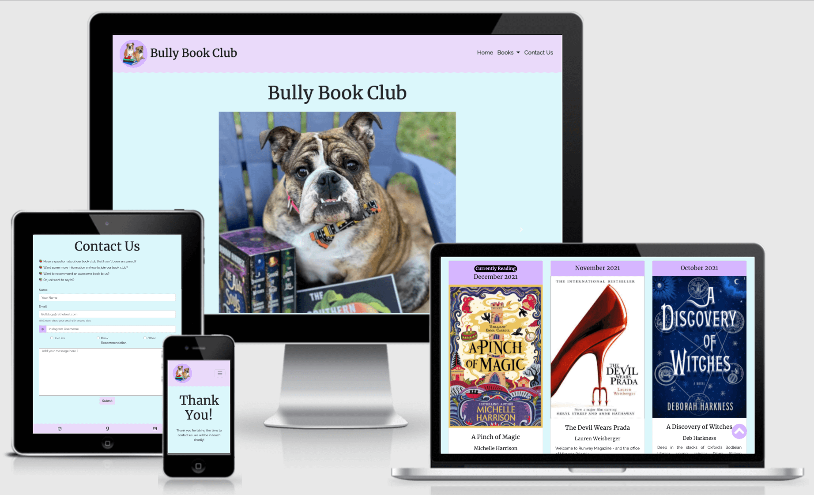
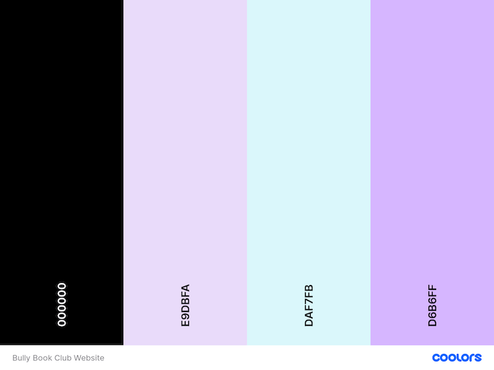
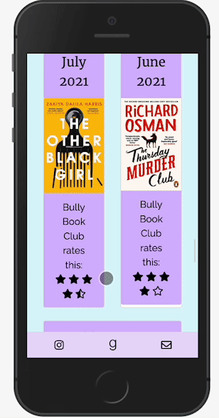

# Bully Book Club Website

The Bully Book Club website is designed to be responsive website allowing visitors to view on a range of devices. It allows visitors to find out about the book club.

[View Bully Book Club on Github Pages](https://kera-cudmore.github.io/milestone-project-one-ci/)

## CONTENTS

* [User Experience (UX)](#User-Experience-(UX))
  * [Initial Discussion](#Initial-Discussion)
  * [User Stories](#User-Stories)

* [Design](#Design)
  * [Colour Scheme](#Colour-Scheme)
  * [Typography](#Typography)
  * [Imagery](#Imagery)
  * [Wireframes](#Wireframes)
  * [Features](#Features)

* [Technologies Used](#Technologies-Used)
  * [Languages Used](#Languages-Used)
  * [Frameworks, Libraries & Programs Used](#Frameworks,-Libraries-&-Programs-Used)

* [Deployment](#Deployment)
  * [Initial Deployment](#Initial-Deployment)
  * [How to Fork](#How-to-Fork)
  * [How to Clone](#How-to-Clone)

* [Testing](#Testing)
  * [W3C Validator](#W3C-Validator)
  * [Solved Bugs](#Solved-Bugs)
  * [Known Bugs](#Known-Bugs)
  * [Testing User Stories](#Testing-User-Stories)
  * [Lighthouse](#Lighthouse)
    * [Performance](#Performance)
    * [Accessibility](#Accessibility)
    * [Best Practices](#Best-Practices)
    * [SEO](#SEO)
  
* [Credits](#Credits)
  * [Code Used](#Code-Used)
  * [Content](#Content)
  * [Media](#Media)
  * [Acknowledgments](#Acknowledgments)

- - -

## User Experience (UX)

### Initial Discussion

Bully Book Club is an online book club that reviews a book once a month on Instagram. Members post a photo of the book with their bulldog with a review and use hashtags to drive up the visibility of the chosen book, author and publisher on that day.

Due to a recent growth in membership and personal commitments, the owner of bully book club is spending a large amount of time answering questions from users asking what the book club is reading and how to participate.

#### Key information for the site

* What is the current months book.
* What are the next books.
* How to become a member and take part.
* A way for people to contact the book club with questions and recommendations.
* Updates on what is coming to the book club in 2022.

### User Stories

#### Client Goals

* To be able to view the site on a range of device sizes.
* To make it easy for potential members to find out what the book club is and how to take part.
* To make it clear for members to see what we are currently reading and what is coming up next.
* To allow people to be able to contact the Book Club to ask further questions or with book recommendations etc.

#### First Time Visitor Goals

* I want to find out what is Bully Book Club and how I can take part.
* I want to be able to navigate the site easily to find information.
* I want to be able to find their Instagram profile.

#### Returning Visitor Goals

* I want to find up to date information on what the book club is reading.
* I want to be able to easily contact the book club with questions I might have.

#### Frequent Visitor Goals

* I want to be able to recommend a book for the book club to read.

- - -

## Design

### Colour Scheme

The website uses a palette of pastel colours that are often used in the Bully Book Club logo images. The colour palette was created using the [Coolors](https://coolors.co/) website.

### Typography

Google Fonts was used for the following fonts:

* Merriweather is used for headings on the site. It is a serif font.

* Raleway is used for the body text on the site. It is a sans-serif font.  

* Indie Flower is used on the thank you page for Harrison Fords message. It is a cursive font.

### Imagery

The member images were used with the permission of their owners. All book covers were taken from the publishers websites. I have credited these in the [credits](#Credits) section.

### Wireframes

Wireframes were created for mobile, tablet and desktop.

[Home Page Wireframe](assets/docs/wireframes/home-page-wireframe.png)

[Books Wireframe](assets/docs/wireframes/books-wireframe.png)

[Contact Us Wireframe](assets/docs/wireframes/contact-us-wireframe.png)

### Features

The website is comprised of four pages, three of which are accessible from the navigation menu (home page, books page & contact us page). The fourth page is a thank you page which is shown once a user submits the form on the contact us page.

* All Pages on the website have:

  * A responsive navigation bar at the top which allows the user to navigate through the site.  To the left of the navigation bar is an image of book clubs logo together with the text Bully Book Club. To the right of the navigation bar are the links to the websites pages (home, books, and contact us). To allow a good user experience of the site, the Bully Book Club text is hidden with a media query on mobile devices to prevent the navigation bar looking cluttered. When viewing with mobile devices the navigation links change to a burger toggler. This was implemented to give the site a clean look and to promote a good user experience, as users are used to seeing the burger icon when on mobile devices to navigate a site.

  * A footer which contains social media icon links to instagram and goodreads. There is also an envelope icon which takes the user to the contact us page. Icons were used to keep the footer clean and because they are universally recognisable.

* Home Page.
  * Carousel Section.
  The carousel shows photographs of the members of Bully Book Club.
  * About Us Section.
  This section is broken down into four subsections and gives users some information on the book club. On large screens the subsections are laid out in a row, however on mobile devices the subsections are stacked vertically.
  * Join Us Section.
  This section gives the user more information on how they can join in with the book club.

* Books Page. The navigation link for books is a drop down menu with the following sections:
  * Currently Reading.
  This takes the user to the card of the book the book club is currently reading.
  * Reading Next.
  This takes the user to the card of the book the book club will be reading next.
  * Yearly Sections.
  This takes the user to the section of the year they have chosen. There are currently 3 years to select from.
  The books page implements a return to top icon which allows users to return to the navigation menu easily from any point as they scroll down the page.

* Contact Us Page.
  * A List of reasons users may want to contact the book club.
  * Form
  The form contains fields for the users name, email address, instagram handle, checkboxes giving a reason for contact and a text area for the user to add further information. The user submits the form using the submit button. Users must fill in the name, email and text area fields to be able to submit the form. If they don't a tooltip will guide them to fill in any information they have missed.

* Thank You Page.
  * A message thanks the user for submitting the form and lets them know someone will be in touch soon.
  * Image and message from Harrison Ford, Dictator of the Bully Bookclub.

* Future Implementations.
  * Use javascript to perform return to top function on books page.
  * Use javascript and listeners to require at least one checkbox to be checked before submitting the form on contact us page.
  * A meet the members page - This would have a photo of the member together with a small bio. A link to their instagram and/or goodreads page.
  * Competitions/giveaways page - This page would give further information/rules on the competitions and giveaways the book club hosts.

- - -

## Technologies Used

### Languages Used

HTML and CSS were used to create this website.

### Frameworks, Libraries & Programs Used

Balsamiq - Used to create wireframes.

Git - For version control.

Github - To save and store the files for the website.

Bootstrap Version 4.6 - The framework for the website. Additional CSS styling was also implemented in style.css.

Google Fonts - To import the fonts used on the website.

Font Awesome - For the iconography on the website.

Google Dev Tools - To troubleshoot and test features, solve issues with responsiveness and styling.

[Tiny PNG](https://tinypng.com/) To compress images.

[Birme](https://www.birme.net/) To resize images.

[Favicon.io](https://favicon.io/) To create favicon.

[Am I Responsive?](http://ami.responsivedesign.is/) To show the website image on a range of devices.

- - -

## Deployment

### Initial Deployment

Github Pages was used to deploy the live website. The instructions to achieve this are below:

1. Log in (or sign up) to Github.
2. Find the repository for this project, milestone-project-one-ci.
3. Click on the Settings link.
4. Click on the Pages link in the left hand side navigation bar.
5. In the Source section, choose main from the drop down select branch menu. Select Root from the drop down select folder menu.
6. Click Save. Your live Github Pages site is now deployed at the URL shown.

### How to Fork

To fork the milestone-project-one-ci repository:

1. Log in (or sign up) to Github.
2. Go to the repository for this project, kera-cudmore/milestone-project-one-ci.
3. Click the Fork button in the top right corner.

### How to Clone

To clone the milestone-project-one-ci repository:

1. Log in (or sign up) to GitHub.
2. Go to the repository for this project, kera-cudmore/milestone-project-one-ci.
3. Click on the code button, select whether you would like to clone with HTTPS, SSH or GitHub CLI and copy the link shown.
4. Open the terminal in your code editor and change the current working directory to the location you want to use for the cloned directory.
5. Type 'git clone' into the terminal and then paste the link you copied in step 3. Press enter.

- - -

## Testing

Testing was ongoing throughout the entire build. I utilised Chrome developer tools while building to pinpoint and troubleshoot any issues as I went along.

The following issues were raised during my mid project meeting with my mentor:

* The Join Us section on the home page was not in alignment with the rest of the page. ~ Padding has now been added to bring it in alignment with the rest of the pages padding.
* There was an issue on smaller devices where the book columns were not displaying properly. ~ more information under issue 2 in solved bugs.
* The introduction paragraph on the books page was not aligned in style with the rest of the page. ~ The text has now been centered.
* The form could be submitted with only a name filled in. ~ A required attribute has been added to the email input and textarea.

### W3C Validator

The W3C validator was used to validate the HTML on all pages of the website. It was also used to validate CSS in the style.css file.

* [Index Page HTML](assets/docs/testing/w3c-index.png)
* [Books Page HTML](assets/docs/testing/w3c-books.png)
* [Contact Us Page HTML](assets/docs/testing/w3c-contact.png)
* [Thank You Page HTML](assets/docs/testing/w3c-thankyou-test.png)
* [style.css CSS](assets/docs/testing/w3c-css-test.png)

### Solved Bugs

1. The navbar would lose its alignment when on smaller devices, with the navbar brand pushing the burger icon down and over to the left underneath the site logo. This did not make for a good user experience, as the sites navigation for other sizes is on the right hand side of the navbar. While searching through the bootstrap documentation for navigation bars it directed me to display properties and hiding elements. Once I added the correct class I was then able to hide the navbar brand on devices smaller than a tablet, allowing the alignment of the navbar items to stay in place where I wanted them.

2. The cards on the books page were very long when on smaller devices, causing the user to scroll for a while before seeing the next book. By using a media query to hide the card body I am able to condense the card for a better viewing experience on smaller devices.

3. Halfway down the books page on small devices the columns would jump from displaying one column to displating two colums. After trying several ways to change this with no effect, I posed the problem to the slack community. Simen Daehlin suggested that I specify on the column class what sizes I would use for the screen sizes. By adding these column size classes it has resolved the problem. 

4. The textarea required attribute wasn't activating when the form was submitted. After searching for an answer, I asked on slack and Dave Horrocks spotted that as I had a message in the textarea it was reading that as a message had been entered in the textarea. By adding the message into a placeholder the issue has been rectified.

5. When viewing the books page which is very long, you would have to scroll all the way back up to the top to reach any navigation links. I thought a scroll to top button that floats on the bottom right would fix this problem, however I do not have any javascript knowledge currently to be able to achieve this. One alternative suggested by Dave Horrocks on slack was to change the top navbar to be fixed to the top, so this would be visable at all times. By adding the bootstrap class fixed-top I was able to achieve this. Then Dave suggested that I could use an anchor with an ID to achieve something that would work to achieve a scroll to top. He shared a codepen on slack showing how this would work I used the example of the codepen to create my return to top, and removed the fixed top class from my navigation bar to allow more space to view the books information.

6. When I removed the fixed-top from my navbars there was a gap between the navbar and the top of the page. I added a class of navbar-top to the navbar and used CSS to positon the navbar to the top and left of the page. I added the width of 100% so the navbar would fill the width of the page.

7. The carousel displayed fine on small screen devices, however when viewed on larger devices you would need to scroll down to see the entire image, which led to a bad user experience. By using media queries I targeted the large screen size and targeted the carousel item image to only take up 85% of the viewport height. This solved the issue by allowing the user to view the image without having to scroll, but the image was now being stretched across the screen. I searched google and stack overflow and it mentioned using object fit. I researched this further on MDN web docs and added object-fit: contain to the css which allows the image to correctly maintain its aspect ratio and view correctly.

8. The footer was displaying at the bottom of the screen as I had used a nav tag within the footer with the class fixed bottom. As I reviewed my code for errors I realised that there was no need for a nav tag to be used within the footer. When I removed this I had to add some additional styling to the style.css file to add a background colour and some padding to the footer.

9. When I asked for peer review on slack Anthony O'Brien pointed out that I was missing the container for the join us section on the home page. I had already added the css to style this section but had missed out putting the container class into the HTML. I have now added the container class to this section.

10. The thank you page on small mobile devices was not displaying correctly as the image was off to one side and the navbar and footer did not reach across the page width. After struggling with this for a few days I reached out to Anthony O'Brien to see if he could point me in the right direction to solve this issue. He told me that it was simply an overflow issue and that by reducing the width of the image it would solve the issue. I have added an id to the issue and targeted the width to be 50% in the css.

### Known Bugs

1. Users are able to submit the contact us form without selecting any of the checkboxes. I would have preferred it so that at least one checkbox was selected before the form could be submitted, however when researching this problem I was unable to find a way to achieve this without the use of javascript. I asked on slack whether there was a way to achieve this, it was suggested that I could change the checkboxes to radios, however I wanted users to be able to select more than one option if they needed so this solution wouldn't work. The community confirmed that they only way they could think on to achieve this with checkboxes would be through the use of javascript and change listeners on the checkboxes. As I do not have any experience so far with javascript this is something I am currently unable to implement, but would like to add to the website in a future update.

### Testing User Stories

* First Time Visitors
  * I want to find out what is Bully Book Club and how I can take part.
  The about us and join us sections of the home page answer some common questions and explain how to take part.
  * I want to be able to navigate the site easily to find information.
  All site navigation is in the top navigation bar, which consistantly appears on all pages of the site. As you are able to scroll for a long time on the book page, a return to top has been added to make it easy for users to return to the navigation menu.
  * I want to be able to find their Instagram profile.  
    The instagram icon and link for Bully Book Club is presented on each page in the footer. This opens a new browser window to instagram for a good user experience.

* Returning Visitors
  * I want to find up to date information on what the book club is reading.
  In the navigation menu there is are links to take you directly to what the book club is currently reading and what they will be reading next. The books also display a badge showing that this book is the current read and reading next.
  * I want to be able to easily contact the book club with questions I might have.
  A contact us page provides a form that users can fill in to contact the book club with any questions they might have. The use of a text area input allows the user to ask their specific question.

* Frequent Visitors
  * I want to be able to recommend a book for the book club to read.
  The contact us page allows users to select a checkbox for book recommendations. They are then able to add the books information into the text area.

### Lighthouse

I used Lighthouse within the Chrome Developer Tools to allow me to test the performance, accessibility, best practices and SEO of the website.

#### Index Page

[Lighthouse Testing for Desktop Index Page](assets/docs/testing/index-desktop-lighthouse.png)
[Lighthouse Testing for Mobile Index Page](assets/docs/testing/index-mobile-lighthouse.png)

Performance - Lighthouse suggested the following:

* Properly sized images to improve load time.
* Serve images in next-gen formats. Lighthouse suggests using image formats such as WebP & AVIF to improve compression and lead to faster downloads and less data consumption.
  * This is something that I will be doing some further research on and could possibly implement at a later date.
  
#### Books Page

[Lighthouse Testing for Desktop Books Page](assets/docs/testing/books-desktop-lighthouse.png)
[Lighthouse Testing for Mobile Books Page]()

#### Contact Us Page

[Lighthouse Testing for Desktop Contact Us Page](assets/docs/testing/contact-desktop-lighthouse.png)
[Lighthouse Testing for Mobile Contact Us Page](assets/docs/testing/contact-mobile-lighthouse.png)

Performance - Lighthouse suggested the following:

* Properly sized images to improve load time.
* Serve images in next-gen formats. Lighthouse suggests using image formats such as WebP & AVIF to improve compression and lead to faster downloads and less data consumption.
  * This is something that I will be doing some further research on and could possibly implement at a later date.

Accessibility - Lighthouse suggested the following:

* There is not a sufficient contrast on the small tag underneath the email input.
  * I have targeted the text-muted class and changed the color of the text in order to improve the contrast. By doing this I have improved the accessibility score to 100.

#### Thank You Page

[Lighthouse Testing for Desktop Thank You Page](assets/docs/testing/thankyou-desktop-lighthouse.png)
[Lighthouse Testing for Mobile Thank You Page](assets/docs/testing/thankyou-mobile-lighthouse.png)

- - -

## Credits

### Code Used

* [Abi Harrison's Meta Tags webinar and repository](https://github.com/Abibubble/meta-tags-example)
* [Tutorial to change bullet images to emojis](https://daily-dev-tips.com/posts/css-emoji-list-style/)
* [Dave Horrocks Copepen for the scroll to top](https://codepen.io/daveyjh/pen/GRMmqOO)

### Content

Content for the website was written by the owner of Bully Book Club and Kera Cudmore.

### Media

#### Book Cover Images

* Each book cover was taken from the publishers website.

2022 Books

[Taste](https://www.simonandschuster.com/books/Taste/Stanley-Tucci/9781982168018)

2021 Books

[A Pinch of Magic](https://www.simonandschuster.co.uk/books/A-Pinch-of-Magic/Michelle-Harrison/A-Pinch-of-Magic-Adventure/9781471124297) ~
[The Devil Wears Prada](https://harpercollins.co.uk/products/the-devil-wears-prada-loved-the-movie-read-the-book-lauren-weisberger?variant=32555806359630) ~
[A Discovery of Witches](https://www.penguinrandomhouse.com/books/307548/a-discovery-of-witches-movie-tie-in-by-deborah-harkness/) ~
[The Southern Book Clubs Guide to Slaying Vampires](https://www.penguinrandomhouse.com/books/608677/the-southern-book-clubs-guide-to-slaying-vampires-by-grady-hendrix/) ~
[The Last Thing He Told Me](https://www.simonandschuster.com/books/The-Last-Thing-He-Told-Me/Laura-Dave/9781501171345) ~
[A Good Girls Guide to Murder](www.penguinrandomhouse.com/books/607351/a-good-girls-guide-to-murder-by-holly-jackson/) ~
[The Other Black Girl](https://www.bloomsbury.com/uk/other-black-girl-9781526630377/) ~
[The Thursday Murder Club](https://www.penguin.co.uk/books/315/315815/the-thursday-murder-club/9780241988268.html) ~
[The Underground Railway](https://www.hachette.co.uk/titles/colson-whitehead/the-underground-railroad/9780708898406/) ~
[Bridgerton The Duke and I](https://www.harpercollins.com/products/the-duke-and-i-julia-quinn?variant=33097598468130) ~
[The Shadow of the Wind](https://www.penguinrandomhouse.com/books/292766/the-shadow-of-the-wind-by-carlos-ruiz-zafon/) ~
[My Sister the Serial Killer](https://www.penguinrandomhouse.com/books/588860/my-sister-the-serial-killer-by-oyinkan-braithwaite/) ~
[The Midnight Library](https://www.penguinrandomhouse.com/books/575653/the-midnight-library-by-matt-haig/) ~

2020 Books

[Nevermore](https://www.hachette.co.uk/titles/jessica-townsend/nevermoor/9781510104112/) ~
[Good Omens](https://www.harpercollins.com/products/good-omens-neil-gaimanterry-pratchett?variant=32179607535650) ~
[Starfell](https://harpercollins.co.uk/products/starfell-willow-moss-and-the-lost-day-starfell-book-1-dominique-valente?variant=32558089175118) ~
[Circe](https://www.littlebrown.com/titles/madeline-miller/circe/9780316556347/) ~
[Luckiest Girl Alive](https://www.simonandschuster.com/books/Luckiest-Girl-Alive/Jessica-Knoll/9781476789644) ~
[Ballard of Songbirds & Snakes](https://shop.scholastic.com/parent-ecommerce/books/the-ballad-of-songbirds-and-snakes-a-hunger-games-novel-9781338635171.html) ~
[The Martian](https://www.penguinrandomhouse.com/books/234102/the-martian-by-andy-weir/) ~
[Queenie](https://www.simonandschuster.com/books/Queenie/Candice-Carty-Williams/9781501196027#:~:text=Queenie%20%7C%20Book%20by%20Candice%20Carty,Official%20Publisher%20Page%20%7C%20Simon%20%26%20Schuster) ~
[Born a Crime](https://www.penguinrandomhouse.com/books/537515/born-a-crime-by-trevor-noah/) ~
[The Hunting Party](https://www.harpercollins.com/products/the-hunting-party-lucy-foley?variant=32205604978722https://www.harpercollins.com/products/the-hunting-party-lucy-foley?variant=32205604978722) ~
[Boy at the Back of the Class](https://www.penguinrandomhouse.com/books/602100/the-boy-at-the-back-of-the-class-by-onjali-q-rauf/) ~
[This is going to Hurt](https://www.panmacmillan.com/authors/adam-kay/this-is-going-to-hurt/9781509858613) ~

2019 Books

[Hercule Poirot Christmas](https://harpercollins.co.uk/products/hercule-poirots-christmas-agatha-christie?variant=32553530556494) ~
[Crazy Rich Asians](https://www.penguinrandomhouse.com/books/222866/crazy-rich-asians-movie-tie-in-edition-by-kevin-kwan/) ~
[Little Darlings](https://harpercollins.co.uk/products/little-darlings-melanie-golding?variant=32546601893966) ~

#### Other Images

* Bully Book Club Logo - with permission from Yasmin Daly, Creator of Bully Book Club.

* All images used in the carousel on the index page are photos of Bully Book Club members who kindly gave their permission for them to be used in this project.
  * [Slide 1](https://www.instagram.com/harrisonfordbulldog/?hl=en)
  * [Slide 2](https://www.instagram.com/gozerandvigo/?hl=en)
  * [Slide 3](https://www.instagram.com/chubbspetersonthebulldog/?hl=en)
  * [Slide 4 & 6](https://www.instagram.com/basicallybusterspage/?hl=en)
  * [Slide 5](https://www.instagram.com/bookswithbubba/?hl=en)

* Illustration of Harrison Ford used on the thank you page - with kind permission from [Harrison Ford](https://www.instagram.com/harrisonfordbulldog/)

### Acknowledgments

I would like to acknowledge the following people who helped me along the way in completing my first milestone project:

* Yasmin Daly, Creator of Bully Book Club, for allowing me to create a website based on the book club.
* [Adegbenga Adeye](https://github.com/deye9), my Code Institute Mentor.
* [Abi Harrison](https://github.com/Abibubble) - For her webinar on meta tags.
* [Simen Daehlin](https://github.com/Eventyret) - For his help with the columns issue.
* [Dave Horrocks](https://github.com/daveyjh) - For his help with the textarea required issue & the return to top on books page.
* [Anthony O'Brien](https://github.com/auxfuse) - For pointing out my missing join us container on the index page & helping me solve the issue of the thank you page overflow.
